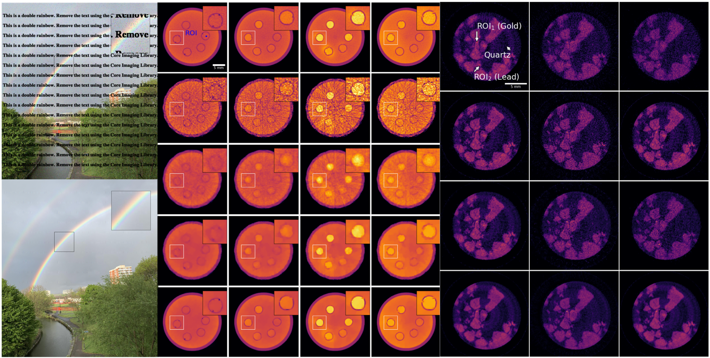

This code reproduces all the results presented in [**Core Imaging Library part II: multichannel reconstruction
for dynamic and spectral tomography**](https://doi.org/10.1098/rsta.2020.0193).



# Instructions

## 1) **Install the environment**

**Note:** Depending on your nvidia-drivers, you can modify the `cudatoolkit` parameter. See [here](https://docs.nvidia.com/deploy/cuda-compatibility/index.html) for more information.

```bash
conda create --name cil2_demos -c conda-forge -c astra-toolbox/label/dev -c ccpi cil cil-astra ccpi-regulariser nb_conda_kernels jupyterlab scikit-image python-wget cudatoolkit=_._
```      

## 2) **Activate the environment**

```bash
conda activate cil2_demos
```

# **Create the environment from the requirements.yml file:**

```bash
conda env create -f environment.yml
```

Then activate the environment: `conda activate cil2_demos` 

## There are 3 directories for 3 different case studies:

- **CaseStudy_ColourProcessing (Section 3)** :
    
    1. Color Denoising
    1. Color Inpainting
    <br></br>
        
- **CaseStudy_DynamicTomography (Section 4)** :   

    1. 01_LoadData_CreateSparseData
    1. 02_FBP_reconstructions
    1. 03_TikhonovReconstructions
    1. 04_TVReconstructions
    1. 05_dTVReconstructions
    1. 06_ShowFigures
    <br></br>
    
- **CaseStudy_HyperspectralTomography (Section 5)** :

    1. 01_LoadRawDataAndCrop
    1. 02_PreProcessRingRemover
    1. 03_SIRT_reconstructions
    1. 04_SPDHG_SpatioSpectralTV
    1. 05_SPDHG_3D_spectral_TV
    1. 06_PDHG_SpatioSpectralTV
    1. 07_ShowFigures
    <br></br>
    
# Reference
    
Papoutsellis E et al. 2021 Core imaging library part II: multichannel reconstruction for dynamic and spectral tomography. Phil. Trans. R. Soc. A 20200193.           https://doi.org/10.1098/rsta.2020.0193, [preprint](https://arxiv.org/pdf/2102.06126)

